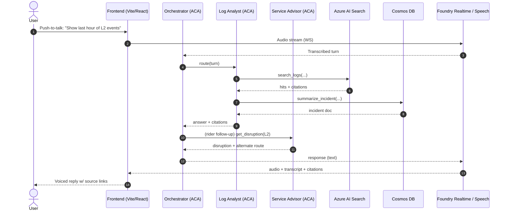

# 🚇 Crosstown — MTA AI Agent Hackathon Accelerator

> Reference stack + **opt-in scaffolding** for the NYCMTA AI Hackathon · Track 2 (App Modernization with GitHub Copilot) · **May 19–20, 2026**

[]()
[]()
[]()
[]()
[]()

---

## 🌐 Live demos

- **Rider copilot (text + voice):** https://frontend.blackriver-0ab9be19.swedencentral.azurecontainerapps.io/
- **Coach judging app:** https://mango-hill-0ee13cb0f.7.azurestaticapps.net/

## 📌 Read this first — what this repo is (and isn't)

The hackathon's **DevTrack**

If your use case is **Power Apps / Copilot Studio / Power Pages**, this isn't your repo — flag a Track 1 coach.

## 🎯 What ships today

A working app that `azd up` deploys in **under 20 minutes** to a brand-new Azure subscription:

- **Orchestrator agent** — receives a voice or text turn, routes to a specialist, composes a cited response.
- **Log Analyst agent** — specialist with three tools:
  - `search_logs(query, time_range)` → Azure AI Search over a mock train-control log corpus
  - `detect_pattern(log_id)` → deterministic regex + windowed correlation
  - `summarize_incident(incident_id)` → Cosmos lookup + LLM summary
- **Service Advisor agent** — second specialist for rider-facing disruption questions:
  - `get_disruption(line)` → current disruption status for L1/L2/L3
  - `find_route(origin, destination)` → alternate-route suggestions
- **Voice UI** — push-to-talk + live transcript + tool-call/citation panel. Foundry Realtime primary, Azure Speech Services fallback.
- **Judging app** — separate Static Web App + Functions for hackathon coaches (GitHub OAuth gated).
- **Eval gate** — golden scenarios; build fails if >5% of turns produce uncited claims.
- **CI/CD** — `ci.yml`, `eval.yml`, `deploy.yml`, `deploy-judging.yml` ready to use.

Everything else is an [extension](docs/extensions/).

## 🧭 Hero flow



## 🗂️ Repo layout

- `apps/frontend/` — React/Vite chat UI (push-to-talk, streaming, tool-call panel)
- `apps/orchestrator/` — FastAPI WebSocket relay + Azure AI Foundry Realtime bridge
- `apps/log_analyst/`, `apps/service_advisor/` — Tool-call specialists (Python)
- `apps/judging/` — Static Web App + Functions for hackathon coaches
- `docs/` — architecture, voice loop, evals, red team, use-case mapping
- `infra/` — Bicep + Azure Developer CLI config
- `evals/` — citation gate, orchestrator gate, evaluator logic
- `redteam/` — adversarial scenario library

## 🚀 Fork → deploy → extend

```bash
# 1. Fork or clone into YOUR Devpost-provisioned subscription
git clone <your-fork-url>
cd crosstown-app

# 2. One-command provision + deploy
azd auth login
azd up                # ~15–20 min on first run

# 3. Open the URL azd prints, click the mic, talk to it.

# 4. Pick an extension that matches your use case
#    See docs/use-case-map.md and docs/extensions/
```

### Run pieces locally

**Frontend:**
```bash
cd apps/frontend
npm install
npm run dev          # Vite dev server at http://localhost:5173
```

**Orchestrator** (requires Python 3.11+, Azure CLI auth, Foundry credentials):
```bash
cd apps/orchestrator
pip install -e ".[dev]"
python -m uvicorn main:app --reload --port 8000
```

## 🪜 The extension ladder

Each extension is a 30–60 min slice. Teams pick what fits their submitted use case. **Extensions are exercises, not pre-built features.** Each folder ships docs + acceptance criteria + failing tests; teams make the tests pass.

| #  | Extension | Time |
|----|-----------|------|
| 01 | [Add a Health Analyst specialist](docs/extensions/01_add_health_analyst/) | 60 min |
| 02 | [Swap the grounding corpus](docs/extensions/02_swap_grounding_corpus/) | 30 min |
| 03 | [Add a tool to an existing specialist](docs/extensions/03_add_tool/) | 30 min |
| 04 | [.NET Framework 4.8 → modern via Copilot](docs/extensions/04_legacy_modernization/) | 60 min |
| 05 | [Wire a modernized legacy API as a tool](docs/extensions/05_wire_legacy_to_agent/) | 30 min |
| 06 | [Enable the modernize-PR workflow](docs/extensions/06_enable_modernize_pr/) | 15 min |
| 07 | [Frontend rebrand + custom incident view](docs/extensions/07_frontend_rebrand/) | 45 min |
| 08 | [Author 3 domain-specific eval scenarios](docs/extensions/08_custom_evals/) | 30 min |
| 09 | [Postgres as a modernization target](docs/extensions/09_postgres_target/) | 45 min |

## 🗺️ Pick the right path

Open **[docs/use-case-map.md](docs/use-case-map.md)** first — it maps every submitted MTA use case to the part of this repo it lives in and the extension(s) that fit.

## ✅ Status as of 2026-05-18

- ✅ Text input: stable end-to-end (orchestrator → specialists → citations)
- ✅ Service Disruption Advisor: routes for L1/L2/L3 queries
- ✅ Judging app: GitHub OAuth gate, `/api/teams` instrumented
- ✅ Voice input: end-to-end working; assistant reliably replies (brief overlap possible on rapid follow-up)
- Latest commit: `8adf29e` (fix: disable PR #45 auto-cancel so AI reliably talks back)

### 🏆 Demo win condition (Tuesday, 19-May)

- **Minimum:** Text input → specialist tool calls → citations in tool-call panel. Wins on Agent Architecture & Foundry Use (30% judging weight).
- **Stretch:** Voice input working. Not a blocker if text is solid.

## 🧑‍🏫 For hackathon coaches

👉 See **[COACHES.md](./COACHES.md)** for stuck-point playbooks, judging crosswalks, and the coach-side runbook.

## 🛡️ Safety & red team

The repo ships with four CI gates:

| Gate | Workflow | Threshold |
|---|---|---|
| **Citation eval** — every agent turn must cite a source (with pinned IDs where deterministic) | `.github/workflows/eval.yml` (job `citation-gate`) | ≤5% uncited |
| **Orchestrator eval** — user-visible reply contains required substrings + citation token | `.github/workflows/eval.yml` (job `orchestrator-gate`) | 0% failures |
| **Foundry evaluators** (optional) — groundedness/relevance/coherence/retrieval LLM-judge scores | `.github/workflows/eval.yml` (job `foundry-evaluators`) | each score ≥ 3.0 |
| **Red team** — 8 adversarial families (prompt injection, indirect injection, jailbreak, off-domain, PII probe, citation skip, hallucination, token bomb) | `.github/workflows/redteam.yml` (manual + weekly) | zero high/critical, ≤10% overall |

All four gates run hermetically offline (cassettes) and switch to live mode against a deployed env with a single env var. See [docs/evals.md](docs/evals.md) and [docs/redteam.md](docs/redteam.md).

## 📚 Docs

- [docs/architecture.md](docs/architecture.md) — services, data flow, security model
- [docs/voice.md](docs/voice.md) — Foundry Realtime primary path + Speech Services fallback
- [docs/evals.md](docs/evals.md) — citation gate, orchestrator gate, tool routing, Foundry evaluators, [calibration math](../evals/calibration.md)
- [docs/redteam.md](docs/redteam.md) — adversarial scenarios + safety gate
- [docs/use-case-map.md](docs/use-case-map.md) — your use case → where it lives → which extension to try
- [docs/participant-tailoring.md](docs/participant-tailoring.md) — 3 thirty-minute swap recipes

## ⚠️ Notes & guardrails

- **Mock data only.** Every file under `data/` is synthetic. Rail lines are fictional (L1/L2/L3). Nothing references real MTA systems, employees, schedules, or telemetry.
- **No secrets in the repo.** `.env.example` only. Production secrets flow through Key Vault + managed identity.
- **Foundry/code-first.** This is the Track 2 (code) story. Copilot Studio is Track 1.
- **Coach-only material lives elsewhere.** Stuck-point playbooks, judging crosswalks, and team-formation pitches ship in a separate private coach-kit repo (mirrored summary in [COACHES.md](./COACHES.md)).

## 🪪 License

For internal Microsoft US SLED / NYCMTA Hackathon use. Synthetic data only.

---

🚇 _Built for the NYCMTA AI Hackathon · Microsoft US SLED · May 2026_ 🚇
