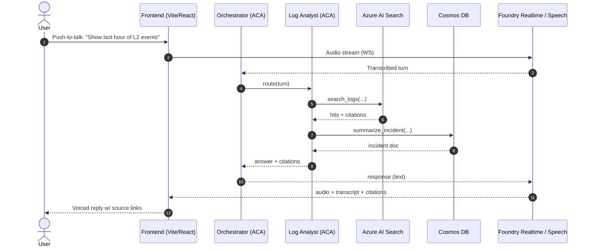

# 🚇 MTA AI Hackathon Accelerator

> **Opt-in scaffolding** for the NYCMTA AI Hackathon · Track 2 (App Modernization with GitHub Copilot) · **May 19–20, 2026**

[]()
[]()
[]()
[]()

---

## 📌 Read this first — what this repo is (and isn't)

The hackathon's **baseline** is your Devpost-provisioned Azure subscription + GitHub Copilot seat. Every team has that. This accelerator is **opt-in**: a working Hour-1 baseline (voice + orchestrator + one specialist agent) that forking teams extend toward their use case. If your team plans to greenfield in your own sandbox instead, treat this repo as an **architectural reference** — patterns to lift, not a path to follow.

If your use case is **Power Apps / Copilot Studio / Power Pages**, this isn't your repo — flag a Track 1 coach.

## 🎯 What ships on day one (the "Hour-1 skeleton")

A minimal, working app that `azd up` deploys in **under 20 minutes** to a brand-new Azure subscription:

- **Orchestrator agent** — receives a voice or text turn, routes to a specialist, composes a cited response.
- **Log Analyst agent** — one specialist with three tools:
  - `search_logs(query, time_range)` → Azure AI Search over a mock train-control log corpus
  - `detect_pattern(log_id)` → deterministic regex + windowed correlation
  - `summarize_incident(incident_id)` → Cosmos lookup + LLM summary
- **Voice UI** — push-to-talk + live transcript + tool-call/citation panel. Foundry Realtime primary, Azure Speech Services fallback.
- **Eval gate** — 8 golden scenarios; build fails if >5% of turns produce uncited claims.
- **CI/CD** — `ci.yml`, `eval.yml`, `deploy.yml` ready to use.

That's it. Everything else is an [extension](docs/extensions/).

## 🧭 Hero flow



## 🚀 Fork → deploy → extend

```bash
# 1. Fork or clone into YOUR Devpost-provisioned subscription
git clone <your-fork-url>
cd mta-ai-hackathon

# 2. One-command provision + deploy
azd auth login
azd up                # ~15–20 min on first run

# 3. Open the URL azd prints, click the mic, talk to it.

# 4. Pick an extension that matches your use case
#    See docs/use-case-map.md and docs/extensions/
```

## 🪜 The extension ladder

Each extension is a 30–60 min slice. Teams pick what fits their submitted use case. **Extensions are exercises, not pre-built features.** Each folder ships docs + acceptance criteria + failing tests; teams make the tests pass.

| #  | Extension | Time |
|----|-----------|------|
| 01 | [Add a Health Analyst specialist](docs/extensions/01_add_health_analyst/) | 60 min |
| 02 | [Swap the grounding corpus](docs/extensions/02_swap_grounding_corpus/) | 30 min |
| 03 | [Add a tool to an existing specialist](docs/extensions/03_add_tool/) | 30 min |
| 04 | [.NET Framework 4.8 → modern via Copilot](docs/extensions/04_legacy_modernization/) | 60 min |
| 05 | [Wire a modernized legacy API as a tool](docs/extensions/05_wire_legacy_to_agent/) | 30 min |
| 06 | [Enable the modernize-PR workflow](docs/extensions/06_enable_modernize_pr/) | 15 min |
| 07 | [Frontend rebrand + custom incident view](docs/extensions/07_frontend_rebrand/) | 45 min |
| 08 | [Author 3 domain-specific eval scenarios](docs/extensions/08_custom_evals/) | 30 min |
| 09 | [Postgres as a modernization target](docs/extensions/09_postgres_target/) | 45 min |

## 🗺️ Pick the right path

Open **[docs/use-case-map.md](docs/use-case-map.md)** first — it maps every submitted MTA use case to the part of this repo it lives in and the extension(s) that fit.

## 📚 Docs

- [docs/architecture.md](docs/architecture.md) — services, data flow, security model
- [docs/voice.md](docs/voice.md) — Foundry Realtime primary path + Speech Services fallback
- [docs/use-case-map.md](docs/use-case-map.md) — your use case → where it lives → which extension to try
- [docs/participant-tailoring.md](docs/participant-tailoring.md) — 3 thirty-minute swap recipes

## ⚠️ Notes & guardrails

- **Mock data only.** Every file under `data/` is synthetic. Rail lines are fictional (L1/L2/L3). Nothing references real MTA systems, employees, schedules, or telemetry.
- **No secrets in the repo.** `.env.example` only. Production secrets flow through Key Vault + managed identity.
- **Foundry/code-first.** This is the Track 2 (code) story. Copilot Studio is Track 1.
- **Coach-only material lives elsewhere.** Stuck-point playbooks, judging crosswalks, and team-formation pitches ship in a separate private coach-kit repo.

## 🪪 License

For internal Microsoft US SLED / NYCMTA Hackathon use. Synthetic data only.

---

🚇 _Built for the NYCMTA AI Hackathon · Microsoft US SLED · 2026_ 🚇
