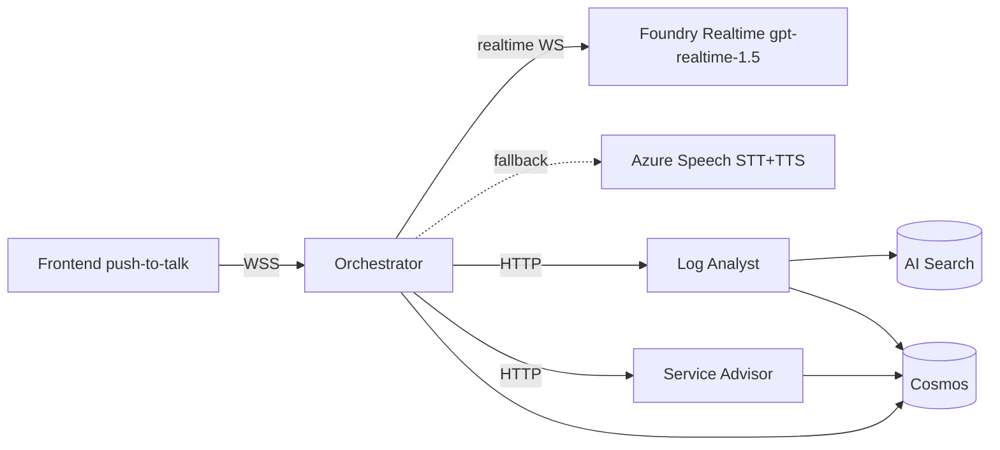

# 🏗️ Architecture

The Crosstown / MTA AI Hackathon accelerator is an opt-in Track 2 scaffolding. It deploys to one Azure subscription via `azd up` and demonstrates a **voice → orchestrator → specialist → cited reply** loop using two specialist agents (Log Analyst, Service Advisor).

## 🧩 Services

| Service | Tech | ACA ingress | Responsibility |
|---|---|---|---|
| `frontend` | Vite + React + shadcn/ui | external :80 | Push-to-talk, transcript, tool-call/citation panel |
| `orchestrator` | Python 3.11 + FastAPI | external :8000 (WebSocket + HTTP) | Routes turns, calls specialists, owns the conversation memory window, brokers voice. Endpoints: `GET /health`, `GET /api/conversations/{id}`, **`POST /api/turn`** (text-only single-turn for evals + red team + non-voice clients), `WS /ws/voice` |
| `log-analyst` | Python 3.11 + FastAPI | internal :8001 | Three tools (`search_logs`, `detect_pattern`, `summarize_incident`); every response carries citations |
| `service-advisor` | Python 3.11 + FastAPI | internal :8002 | Rider-facing tools (`get_disruption`, `find_route`) for L1/L2/L3 service status with citations |
| `judging` | Azure Static Web App + Functions | external (SWA) | Coach-facing judging app (GitHub OAuth gated); endpoints `/api/teams`, `/api/myscores` |

## ☁️ Azure resources (Bicep-provisioned)

- **Azure AI Foundry** — hub + project + AOAI model deployments (`gpt-4.1`, `gpt-realtime-1.5`, `gpt-4o-mini-transcribe`)
- **Azure AI Search** (Basic, semantic search on) — two indexes: `mta-logs`, `mta-runbooks`
- **Cosmos DB for NoSQL** (Serverless) — `incidents` + `conversations` containers
- **Azure Speech Services** (S0) — voice fallback when `VOICE_PROVIDER=speech_services`
- **Postgres Flexible Server** — provisioned **idle**; Extension 09 wires it in
- **ACR** + **Container Apps environment** + **4 Container Apps** (frontend, orchestrator, log-analyst, service-advisor)
- **Static Web App** (judging) + linked **Azure Functions**
- **Key Vault** (RBAC), **Log Analytics + App Insights**
- **User-Assigned Managed Identity** — used by all Container Apps for ACR pull + data-plane access

## 🔐 Identity & secrets

- Single user-assigned managed identity attached to all Container Apps
- No keys in code or in env. All data-plane access uses `DefaultAzureCredential` → the UAMI
- Role assignments live in `infra/modules/roleAssignments.bicep`
- The user running `azd up` is granted equivalent dev-time roles for local debugging
- Judging app uses **GitHub OAuth** (no AAD app registration required) — see PR #39

## 🎙️ Voice flow

The voice path is selected by `VOICE_PROVIDER` env var. See [voice.md](voice.md) for details. **PR #60** disabled the relay-level auto-cancel that was occurring during tool-execution windows; the assistant now reliably replies after tool calls (brief overlap possible on rapid follow-up barge-ins is the acceptable trade-off).

## 🔄 Data flow

1. User speaks (or types) → frontend streams audio (or POSTs text) over WSS/HTTP to orchestrator
2. Orchestrator forwards audio to voice provider, receives transcripts in real time
3. Orchestrator routes the user turn to a specialist (Log Analyst for incidents/logs, Service Advisor for rider disruption questions) over HTTP
4. Specialist calls one or more tools; each tool result carries `citations[]`
5. Orchestrator composes the final reply, persists the turn to Cosmos, and returns voice/text to the frontend
6. Citations are surfaced in the frontend's tool-call panel

## 📈 Observability

- OpenTelemetry via `azure-monitor-opentelemetry` in each Python service
- App Insights connection string injected via env (Key Vault for secret form)
- Foundry tracing enabled on every agent turn

## ✅ Quality gates (CI)

| Gate | Workflow / Runner | Threshold | Calibration |
|---|---|---|---|
| Citation | `.github/workflows/eval.yml` job `citation-gate` (`evals/runner.py`) | ≤5% uncited turns | [`evals/calibration.md#citation-gate`](../evals/calibration.md) |
| Orchestrator (incl. tool-routing) | `.github/workflows/eval.yml` job `orchestrator-gate` (`evals/orchestrator_runner.py`) | 0% scenario failures | [`evals/calibration.md#orchestrator-gate`](../evals/calibration.md) |
| Foundry evaluators (optional) | `.github/workflows/eval.yml` job `foundry-evaluators` | each evaluator ≥3.0/5 | [`evals/calibration.md#foundry-evaluators`](../evals/calibration.md) |
| Red team | `.github/workflows/redteam.yml` (manual + weekly) | 0 high/critical AND ≤10% overall | [`evals/calibration.md#red-team-gate`](../evals/calibration.md) |

All gates run hermetically offline (cassettes) and switch to live mode against the deployed orchestrator's `POST /api/turn` (red team, orchestrator) or `LOG_ANALYST_URL/tools/*` (citation) with a single env var.

## 🧱 Extension points

- **New specialists:** copy `apps/log_analyst/` to `apps/<name>/`, add Bicep call in `main.bicep`, register routing in orchestrator
- **New tools:** add to `apps/<specialist>/tools/`, register in the tool router
- **New grounding:** drop a corpus under `data/<your_corpus>/`, extend `scripts/load_search_index.py`

See [docs/use-case-map.md](use-case-map.md) for which extension fits which submitted use case.

---

## 🏛️ Health at a glance

| Metric | Status |
|--------|--------|
| Services on main reflect docs | [██████████] 100% |
| Bicep modules listed accurate | [██████████] 100% |
| Voice flow mermaid current | [██████████] 100% |
| Quality gates table current | [██████████] 100% |

| Field | Value |
|-------|-------|
| Last reviewed | 2026-05-18 |
| Reviewed by | T'Challa (Lead) |
| Doc owner | Stark (Architect) |
| Related PRs (recent) | [#60](https://github.com/DevPost-Test-Hackathon/crosstown-app/pull/60) disable auto-cancel · [#58](https://github.com/DevPost-Test-Hackathon/crosstown-app/pull/58) frontend rename · [#45](https://github.com/DevPost-Test-Hackathon/crosstown-app/pull/45) stop button + barge-in · [#39](https://github.com/DevPost-Test-Hackathon/crosstown-app/pull/39) GitHub OAuth for judging |
| Related branches in-flight | (none in last 7 days) |
| Next review trigger | When a service is added/removed or a resource changes in Bicep |
